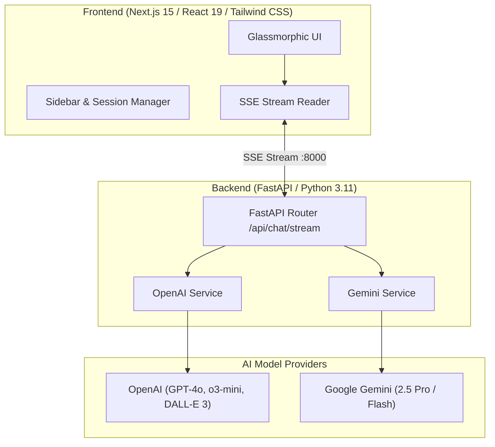

# 🌐 Syntrix AI — Next-Gen Multimodal Chatbot

A production-ready, full-stack AI chatbot platform featuring a **futuristic dark glassmorphic UI**, real-time **Server-Sent Events (SSE) streaming**, **OpenAI & Google Gemini** multi-model reasoning, **DALL-E 3** image generation, and **Docker** orchestration.

---

## 📸 Interface Preview & Features

- **Futuristic Glassmorphic Interface**: Deep obsidian theme with ambient radial glows, frosted glass panels, and an animated 3D glowing centerpiece orb.
- **Real-Time Token Streaming**: Low-latency sub-second response streaming from FastAPI backend to the Next.js frontend via Server-Sent Events (SSE).
- **💡 Deep Think Reasoning Engine**: Multi-step chain-of-thought accordion displaying the model's live reasoning process.
- **🖼 Image Generator**: Integrated with DALL-E 3 for high-resolution visual art generation and cinematic prompt styling.
- **🎬 Video Storyboard Generator**: Generates 3-scene camera angles, timecodes, and directorial prompts.
- **💻 Dev Assistant**: Automated code refactoring, AST explanations, and bug detection.
- **Multi-Model Support**: Switch seamlessly between **GPT-4o**, **GPT-4o mini**, **o3-mini**, and **Gemini 2.5 Pro**.
- **Dockerized Architecture**: Fully containerized multi-tier setup with production-grade Next.js standalone runner and FastAPI backend.

---

## 🏗 Architecture & Tech Stack



| Layer | Technology | Purpose |
| :--- | :--- | :--- |
| **Frontend** | [Next.js 15](https://nextjs.org/) (React 19 App Router) | SSR/CSR UI, responsive glassmorphic components, audio input |
| **Styling** | [Tailwind CSS](https://tailwindcss.com/) + Custom CSS3 | Dark obsidian palette, radial glows, 3D floating orb sphere |
| **Icons** | [Lucide React](https://lucide.dev/) | Clean modern icon library |
| **Backend** | [FastAPI](https://fastapi.tiangolo.com/) + [Uvicorn](https://www.uvicorn.org/) | High-performance async Python backend with SSE streaming |
| **AI SDKs** | `openai` & `google-genai` | Multi-provider intelligence, reasoning chains, and image gen |
| **Containerization** | [Docker](https://www.docker.com/) & Docker Compose | Multi-container development & production orchestration |

---

## 📁 Project Structure

```text
Chat_bot_001/
├── backend/
│   ├── services/
│   │   ├── openai_service.py    # OpenAI streaming, DALL-E 3, & code assistant
│   │   └── gemini_service.py    # Google Gemini streaming & search grounding
│   ├── app.py                   # FastAPI routes & CORS setup
│   ├── Dockerfile               # Python 3.11 container definition
│   ├── requirements.txt         # Python dependencies
│   └── .dockerignore            # Backend build ignore rules
├── frontend/
│   ├── src/
│   │   ├── app/
│   │   │   ├── globals.css      # Design system, 3D orb, & glassmorphism
│   │   │   ├── layout.tsx       # Root layout & dark theme metadata
│   │   │   └── page.tsx         # Main chat stage & view coordinator
│   │   ├── components/
│   │   │   ├── Sidebar.tsx      # Syntrix branding, features, & history
│   │   │   ├── TopNav.tsx       # Model dropdown & navigation
│   │   │   ├── WelcomeView.tsx  # Hero 3D orb & prompt box with tools
│   │   │   ├── ChatInterface.tsx# Streaming chat & Deep Think accordion
│   │   │   ├── UpgradeModal.tsx # Pro subscription tier modal
│   │   │   ├── SettingsModal.tsx# API keys & temperature settings
│   │   │   └── HelpModal.tsx    # Documentation & tips modal
│   │   └── lib/
│   │       └── api.ts           # SSE streaming reader client
│   ├── Dockerfile               # Next.js multi-stage production build
│   ├── package.json             # Frontend dependencies
│   ├── tailwind.config.ts       # Tailwind CSS configuration
│   └── .dockerignore            # Frontend build ignore rules
├── .dockerignore                # Root Docker ignore rules
├── .gitignore                   # Root Git ignore rules
├── .env.example                 # Environment variables template
├── docker-compose.yml           # Multi-service container orchestration
└── README.md                    # Project documentation
```

---

## ⚙ Environment Configuration

Create a `.env` file in the root directory (or copy from `.env.example`):

```bash
cp .env.example .env
```

Edit `.env` with your API keys:

```env
# OpenAI API Key (Primary)
OPENAI_API_KEY=sk-proj-your_openai_api_key_here

# Google Gemini API Key (Optional)
GEMINI_API_KEY=your_gemini_api_key_here

# Frontend Configuration
NEXT_PUBLIC_API_URL=http://localhost:8000

# Backend Configuration
PORT=8000
HOST=0.0.0.0
```

---

## 🚀 Getting Started

### Option 1: Run with Docker (Recommended)

1. Make sure **Docker Desktop** is running.
2. Build and start the services from the project root:

```bash
docker compose up --build -d
```

3. Access the application:
   - **Frontend UI**: [http://localhost:3000](http://localhost:3000)
   - **FastAPI Backend**: [http://localhost:8000](http://localhost:8000)
   - **Interactive API Docs (Swagger)**: [http://localhost:8000/docs](http://localhost:8000/docs)

4. To stop the containers:
```bash
docker compose down
```

---

### Option 2: Run Locally (Without Docker)

#### 1. Start the FastAPI Backend
```bash
cd backend
python -m venv .venv
# On Windows:
.venv\Scripts\activate
# On macOS/Linux:
# source .venv/bin/activate

pip install -r requirements.txt
uvicorn app:app --host 0.0.0.0 --port 8000 --reload
```

#### 2. Start the Next.js Frontend
In a separate terminal window:
```bash
cd frontend
npm install
npm run dev
```
Open [http://localhost:3000](http://localhost:3000) in your browser.

---

## 🔌 API Reference

| Method | Endpoint | Description |
| :--- | :--- | :--- |
| `GET` | `/` | Service root and API key verification status |
| `GET` | `/api/health` | Health check endpoint |
| `POST` | `/api/chat/stream` | Server-Sent Events (SSE) real-time streaming endpoint |
| `POST` | `/api/generate/image` | DALL-E 3 image generation & visual prompt expander |
| `POST` | `/api/generate/video` | Cinematic multi-scene storyboard generator |
| `POST` | `/api/tools/code` | Dev assistant code debugging & refactoring engine |

---

## 📄 License
This project is licensed under the MIT License.