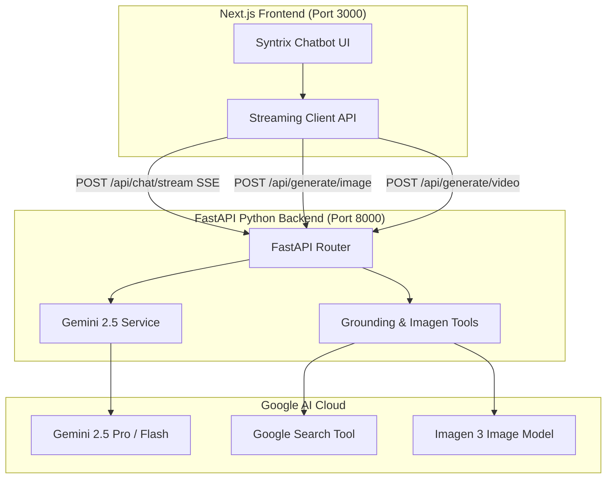

# Implementation Plan: Python FastAPI Gemini Backend & UI Integration

Connect Google Gemini to the FastAPI Python backend with real-time streaming, Deep Think reasoning, Search Grounding, and multimodal tool endpoints, seamlessly hooked into the Next.js chatbot interface.

---

## User Review Required

> [!IMPORTANT]
> - **SDK Choice**: We will use Google's official **`google-genai`** SDK (supporting Gemini 2.5 Pro, Gemini 2.5 Flash, Imagen 3, and Google Search Grounding).
> - **API Key Setup**: Requires a `GEMINI_API_KEY` configured in `.env`.
> - **Streaming Protocol**: Real-time Server-Sent Events (SSE) via `StreamingResponse` for sub-second token streaming and live reasoning chains.

---

## Architecture & Integration Flow

---

## Proposed Changes

### 1. Python Backend (`backend/`)

#### [MODIFY] [`requirements.txt`](file:///d:/cursor/Ai%20projects/course/01/Chat_bot_001/backend/requirements.txt)
Add required dependencies:
- `google-genai>=1.0.0`
- `fastapi>=0.115.0`
- `uvicorn[standard]>=0.32.0`
- `python-dotenv>=1.0.1`
- `pydantic>=2.10.0`
- `pillow>=10.4.0` (for image/multimodal processing)
- `python-multipart>=0.0.18` (for file/document uploads)

#### [NEW] [`backend/services/gemini_service.py`](file:///d:/cursor/Ai%20projects/course/01/Chat_bot_001/backend/services/gemini_service.py)
Encapsulate Gemini interactions:
- Client initialization with `GEMINI_API_KEY`.
- `stream_chat(messages, model, deep_think, enable_search)`: Generator yielding JSON SSE chunks (reasoning tokens, answer tokens, sources).
- `generate_image(prompt, aspect_ratio)`: Generates image prompts or direct Imagen 3 images.
- `generate_video_storyboard(prompt)`: Generates structured video cinematic scenes and prompt scripts.
- `analyze_code(code, language, task)`: Code explanation, optimization, and debugging engine.

#### [MODIFY] [`backend/app.py`](file:///d:/cursor/Ai%20projects/course/01/Chat_bot_001/backend/app.py)
- Enable CORS middleware for `http://localhost:3000` (Next.js frontend).
- **Endpoints**:
  - `POST /api/chat/stream`: SSE streaming endpoint for real-time chat with reasoning and citations.
  - `POST /api/generate/image`: Image creation and prompt enhancement.
  - `POST /api/generate/video`: Video prompt and storyboard generator.
  - `POST /api/tools/code`: Dev assistant code analysis.
  - `GET /api/health`: Health check and API key validation.

---

### 2. Frontend Integration (`frontend/`)

#### [NEW] [`frontend/src/lib/api.ts`](file:///d:/cursor/Ai%20projects/course/01/Chat_bot_001/frontend/src/lib/api.ts)
- Helper functions to communicate with the FastAPI backend.
- ReadableStream reader for streaming SSE tokens directly into the UI state in real-time.
- Handlers for feature cards (`Image Generator`, `Video Generator`, `Dev Assistant`).

#### [MODIFY] [`frontend/src/app/page.tsx`](file:///d:/cursor/Ai%20projects/course/01/Chat_bot_001/frontend/src/app/page.tsx)
- Connect prompt submission to the live `/api/chat/stream` backend.
- Stream tokens incrementally into the message bubble.
- Stream reasoning / thinking steps live into the Deep Think accordion.

---

### 3. Docker & Environment Setup

#### [MODIFY] [`docker-compose.yml`](file:///d:/cursor/Ai%20projects/course/01/Chat_bot_001/docker-compose.yml)
- Pass `GEMINI_API_KEY` from root `.env` to the `backend` service container.
- Configure `NEXT_PUBLIC_API_URL=http://localhost:8000` in the `frontend` container environment.

---

## Verification Plan

### Automated / API Tests
- Health check: `curl http://localhost:8000/api/health`
- Chat streaming test: verify SSE stream outputs tokens, thinking steps, and final completion.
- Specialized task tests:
  - Image generation request test
  - Code debugging query test

### Manual UI Verification
1. Launch via Docker: `docker compose up --build -d`
2. Open [http://localhost:3000](http://localhost:3000)
3. Send a prompt (e.g. *"Explain quantum computing"* with `Deep Think` enabled) and verify real-time streaming tokens and reasoning accordion.
4. Click on `Image Generator` / `Video Generator` / `Dev Assistant` cards and verify task execution.
